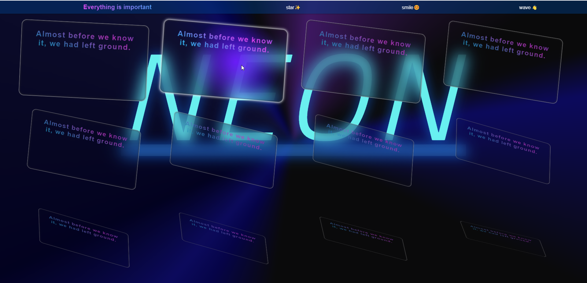
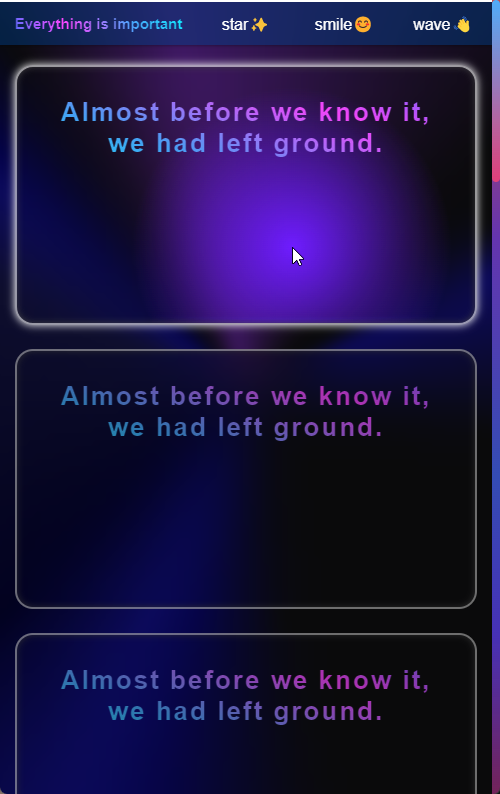

# 👋Hi

> 这个项目是我瞎折腾乱写的 css 样式练习(~~理直气壮~~)
> 页面采用了 grid 和 flex 布局, 此外还使用了一些比较新的 css3 属性, 像是 backdrop: filter 等(好吧, 其实页不算新), 这可能会在一些较老的浏览器(chromium \< 76 )上渲染不正常. 以及界面视图尝试模仿了 jetbrains fleet 官网的部分效果(~~其实颜色代码直接 copy 的 🤣~~).

# References

#### 这个项目参考了一些博主给的样式, 在这里表示感谢

- [峰华前端工程师: Bilibili](https://space.bilibili.com/302954484)
  - [峰华的 github](https://github.com/zxuqian/html-css-examples)

#### 样式参考 && 参考查阅

- [jetbrains fleet 官网](https://www.jetbrains.com/zh-cn/fleet/)
- [文档查阅: MDN](https://developer.mozilla.org)

## 简单展示

- 主页面效果
  
- 最小屏幕宽度
  

## 可能需要注意的地方:

1. 这个项目采用 vite 脚手架搭建, 所以你需要已经有安装 Node 环境(Node Version >= 12)和脚手架, 如果都 OK, 便可以开始

   - 简要步骤(open in terminal: `zsh, bash, powershell...`)

     ```sh
     # 进入项目内并且安装需要的依赖
     cd grid-and-flex-learning && npm run install

     # 打开 dev-server
     npm run dev

     # 打包以部署到 Nginx 等下
     npm run build
     ```

2. 这个项目使用了 sass 来进行 css 的简化编写(~~理直气壮/偷懒 ✌️~~)
3. 这只是我的一个练习/学习的项目(~~所以可能是辣眼的~~)

## 持续更新中(如果我想到什么好玩的)...
